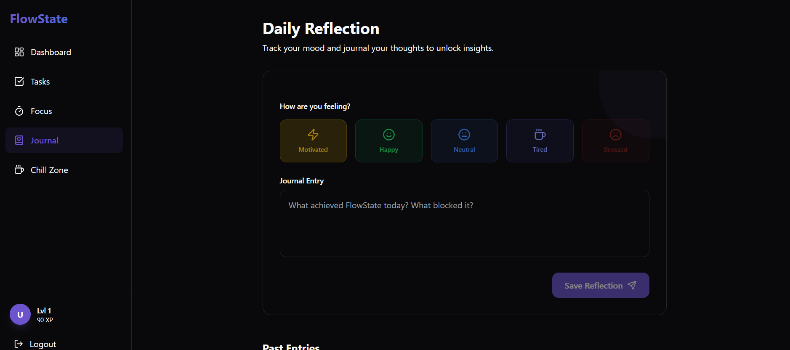

# 🎮 FlowState: Gamified Productivity Web App

A full-stack **MERN gamified productivity application** designed to turn your daily to-dos into an engaging experience. FlowState combines task management with **XP, levels, streaks**, and an **AI-powered Chill Zone** to keep you motivated and productive.

---

## 🚀 Features

### ✅ Core Functionalities
- **Smart Task Management**: Create, update, and prioritize tasks with deadlines.
- **Next Task Suggestion**: An intelligent algorithm that suggests the most impactful task to work on next.
- **Focus Mode**: A built-in Pomodoro-style timer to help you maintain deep work sessions.
- **Mood Journaling**: Log your daily thoughts and feelings.
- **AI Flow Analyzer**: Get personalized insights and burnout warnings based on your recent logs and task volume.

### 🏆 Gamification System
- **XP & Leveling**: Earn XP for every task completed and focus session finished. Level up every 100 XP.
- **Daily Streak Tracking**: Maintain your consistency and watch your streak grow.
- **Daily XP Goal**: Track your progress toward a daily XP goal to unlock rewards.
- **Chill Zone**: An exclusive relaxation area unlocked by earning **50 XP today**. Includes:
  - Curated **Lo-Fi & Binaural Beats** players.
  - Personalized **Movie & Media Recommendations** based on your current burnout levels.

---

## 🧩 Tech Stack

### Frontend
- **React 19** (Vite)
- **Zustand** (State Management)
- **Tailwind CSS** (Styling)
- **Framer Motion** (Animations)
- **Lucide React** (Iconography)

### Backend
- **Node.js & Express.js**
- **MongoDB & Mongoose** (Database)
- **JWT Authentication** (Security)

## Screenshots





---

## 📂 Project Structure

```text
root/
├── backend/                 # Node.js Express server
│   ├── src/
│   │   ├── middleware/      # Auth & request logic
│   │   ├── models/          # MongoDB/Mongoose schemas
│   │   ├── routes/          # API endpoints (Auth, Tasks, Focus, Journal, AI)
│   │   └── utils/           # Scoring & helper logic
│   └── package.json
│
├── frontend/                # React Vite application
│   ├── src/
│   │   ├── components/      # Reusable UI components
│   │   ├── pages/           # Dashboard, Tasks, Focus, Journal, ChillZone
│   │   ├── store/           # Zustand global state (Auth, Tasks, Focus)
│   │   └── assets/          # Styles and media
│   └── package.json
│
└── README.md
```


## ⚙️ Installation & Setup

### 1️⃣ Clone the Repository
```bash
git clone https://github.com/Kinjal2103/gamified-productivity-app.git
cd gamified-productivity-app
```

### 2️⃣ Backend Setup
```bash
cd backend
npm install
```
Create a `.env` file in the `backend` directory:
```env
PORT=5000
MONGO_URI=your_mongodb_connection_string
JWT_SECRET=your_secret_key
```
Run the backend server:
```bash
npm start
```

### 3️⃣ Frontend Setup
```bash
cd frontend
npm install
npm run dev
```
The app will be available at `http://localhost:5173`.

---

## 📈 Gamification Logic

- **Task Completion**: `Base XP = Priority * 10`. Bonuses awarded for early completion.
- **Focus Sessions**: `1 XP per minute` of focused work.
- **Daily XP Tracking**: Resets daily. Used to unlock the **Chill Zone** (Requires 50 XP).
- **Streak Maintenance**: Complete at least one task or focus session daily to keep your streak alive.

---

## 🤝 Contributing

Contributions are welcome!

1. Fork the repo
2. Create a feature branch
3. Commit your changes
4. Open a pull request

---

## 👤 Author

**Kinjal Agarwal**
B.Tech CSE, IIT Patna
GitHub: [https://github.com/Kinjal2103](https://github.com/Kinjal2103)

---

